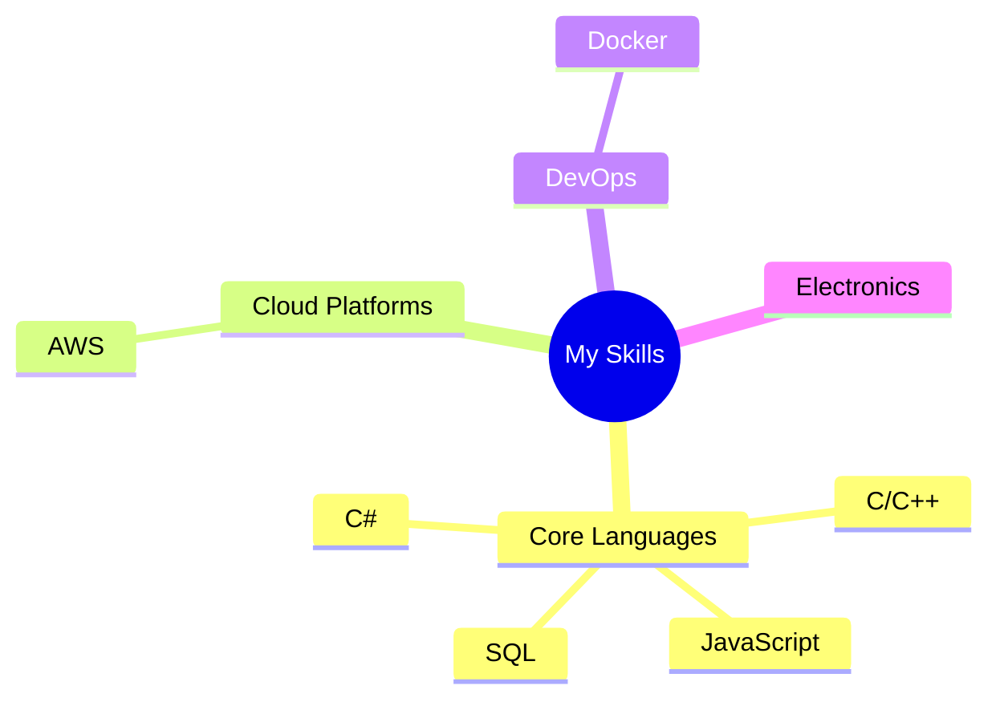

#  Ankan Maity

  <h3>🌟 Asperent Software Engineer | Dotnet Full Stack 🌟</h3>

  
  
  
  
  
  

 <blockquote> <i>Crafting the web today, building intelligent solutions tomorrow.</i> </blockquote> 

I'm Ankan Maity, an aspiring Software Engineer currently focused on web development. As a student and a passionate learner, I enjoy turning ideas into functional, user-friendly web applications.

|  | Frontend & Backend Web Development        |
| :----------------------------------------------------------------------: | :---------------------------------------- |
|  | Building Full-Stack Applications (DOTNET)   |
|  | RESTful APIs & Database Integration       |
|  | Deployment & Version Control (Git/GitHub) |
|  | Creative Problem Solving & UI/UX Focus    |

##  Tech Stack

### Core Technologies

### Development Tools & Frameworks

<!-- ##  Featured Projects & Resources

<table>
  <tr>
    <td align="center"></td>
    <td><b>Project Portfolio:</b></td>
    <td><a href="https://jovian.ai/yash-kavaiya">View on Jovian</a></td>
  </tr>
  <tr>
    <td align="center"></td>
    <td><b>Technical Writing:</b></td>
    <td><a href="https://medium.com/@yash.kavaiya3">Medium Blog</a></td>
  </tr>
  <tr>
    <td align="center"></td>
    <td><b>GenAI Community:</b></td>
    <td><a href="https://discord.gg/cvHXS4b5">Join Discord</a></td>
  </tr>
  <tr>
    <td align="center"></td>
    <td><b>AI Learning Resources:</b></td>
    <td><a href="https://linktr.ee/yashkavaiya">Linktree</a></td>
  </tr>
</table> -->

<!-- ### 🌟 Highlighted Repositories

| Repository                                                         | Description                                                |
| ------------------------------------------------------------------ | ---------------------------------------------------------- |
| [GenAI-Learning](https://github.com/Yash-Kavaiya/GenAI-Learning)   | Curated collection of GenAI learning resources and courses |
| [GenAI-Projects](https://github.com/Yash-Kavaiya/GenAI-Projects)   | Practical generative AI project implementations            |
| [CampusX-courses](https://github.com/Yash-Kavaiya/CampusX-courses) | Free courses and tutorials for AI learning                 | -->

<!-- ##  GitHub Statistics

  

 -->

<!-- ##  Support My Work

  

 -->

##  Connect With Me

  
  
  <!--  -->

---

  <i>"Solving problems and enjoing the beauty of technology"</i>

